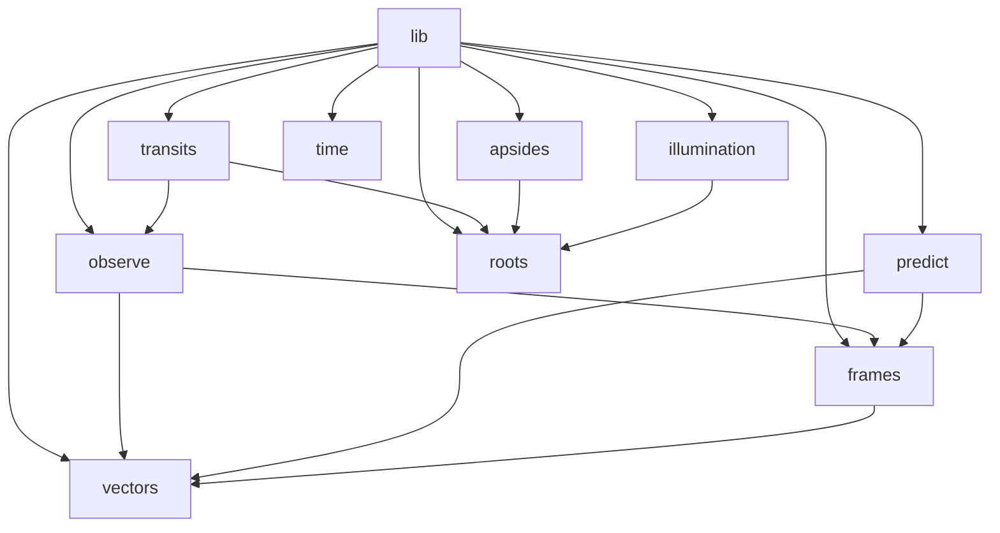
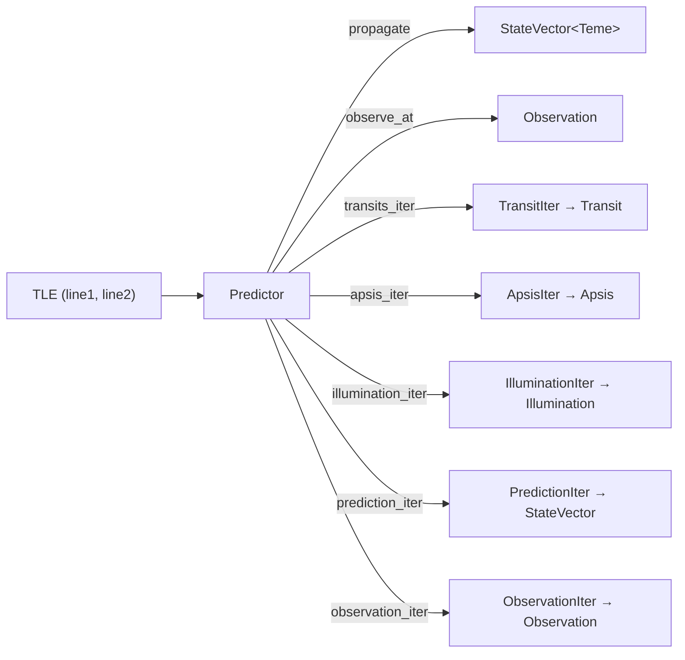

# Architecture

## Overview

`sgp4-predict` is a Rust library that wraps the [`sgp4`](https://crates.io/crates/sgp4) crate to provide
higher-level satellite pass prediction. Where `sgp4` exposes a single propagation call, this library adds
coordinate-frame conversion, ground-observer geometry, and lazy iterators for discovering transits, apsides,
and illumination events over arbitrary time windows.

---

## Module Map

| Module | Responsibility |
|---|---|
| `lib.rs` | `Predictor` struct — public API entry point |
| `predict.rs` | SGP4 call + km→m unit conversion; `StateVector<Teme>` production |
| `observe.rs` | TEME→ECEF→ENU→Observation pipeline; `Observation` type |
| `transits.rs` | Adaptive-step transit iterator; AoS/LoS root refinement |
| `apsides.rs` | Fixed-step apogee/perigee detector; Brent refinement |
| `illumination.rs` | Cylindrical shadow model; sunlit/eclipse boundary finder |
| `frames.rs` | Phantom marker types: `Teme`, `Ecef`, `Enu` |
| `vectors.rs` | `StateVector<F>`, `Position<F>`, `Velocity<F>` generic over frame |
| `roots.rs` | Newton-Raphson and Brent's method root-finding primitives |
| `time.rs` | `IntervalRange` trait; impls for `Range<DateTime<Utc>>`, `Transit`, `Illumination` |

---

## Data Pipeline

All paths start with a TLE. `Predictor` holds the parsed `sgp4::Elements` and exposes methods at two levels:

- **Point queries** (`propagate`, `observe_at`): return a single value for a specific instant.
- **Iterators** (`transits_iter`, `apsis_iter`, etc.): lazily scan a time window and yield events or samples.

---

## Key Design Decisions

### Type-safe coordinate frames

Coordinate frames are enforced at compile time using phantom marker structs (`Teme`, `Ecef`, `Enu`).
`StateVector<Teme>` and `StateVector<Ecef>` are distinct types; conversion methods exist only in the right
direction. An attempt to call `to_enu` on a `StateVector<Teme>` directly is a compile error. This eliminates
an entire class of silent numerical bugs at zero runtime cost. See [coordinate-frames.md](coordinate-frames.md)
for details.

### SI units throughout

The `sgp4` crate returns positions in kilometres and velocities in km/s. This library immediately converts to
metres and m/s in the `From<sgp4::Prediction>` impl in `predict.rs`. All public types and internal
calculations use SI units exclusively, so callers never need unit-conversion bookkeeping.

### Iterator-based event discovery

Transit, apsis, and illumination detection are exposed as Rust iterators. This design is:

- **Lazy**: computation happens only when `next()` is called; no upfront scan of the entire interval.
- **Composable**: standard iterator adaptors (`take`, `filter`, `take_while`, etc.) work without modification.
- **Early-termination friendly**: a caller searching for the next transit can stop as soon as one is found.

### `IntervalRange` trait

Both `Range<DateTime<Utc>>` and event types (`Transit`, `Illumination`) implement the `IntervalRange` trait.
This allows a found transit to be passed directly as the time window for a downstream `prediction_iter` or
`observation_iter` call, without manually extracting start/end times.

### Hybrid root-finding

Event boundary crossing times (AoS, LoS, apsis, shadow boundary) are refined using a two-stage approach:

1. **Newton-Raphson** — fast quadratic convergence when the initial estimate is close; uses the elevation
   rate (or equivalent derivative) as the gradient.
2. **Brent's method** — bracketed, guaranteed convergence fallback when Newton-Raphson diverges or overshoots.

This gives typical single-digit millisecond timing precision on a known bracket without sacrificing robustness.
See [event-detection.md](event-detection.md) for algorithm details.
