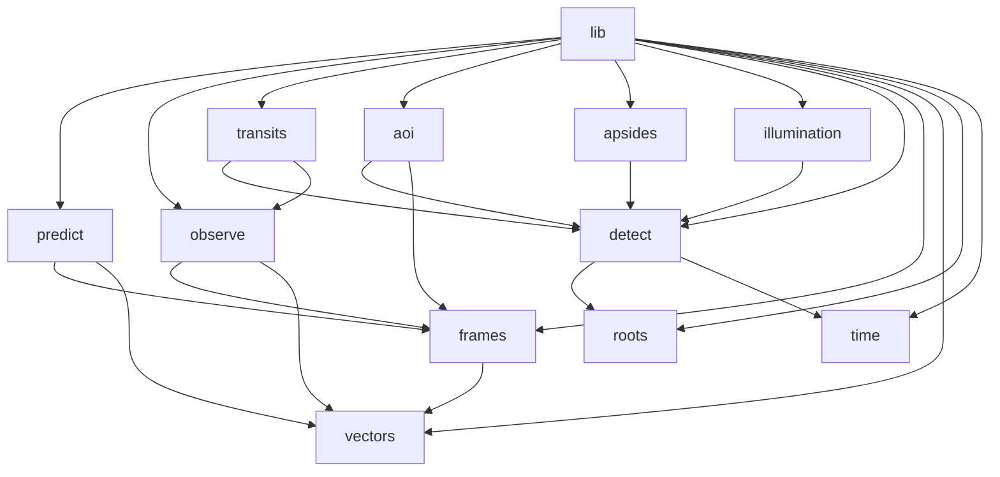
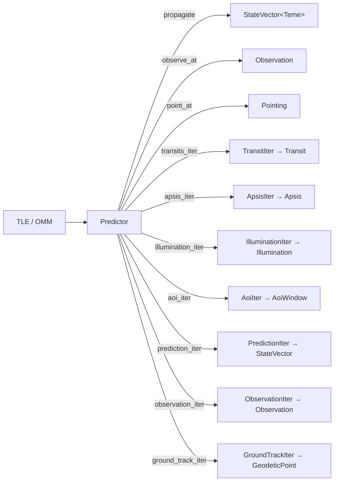

# Architecture

`sgp4-predict` wraps the [`sgp4`](https://crates.io/crates/sgp4) crate. Where `sgp4` exposes a
single propagation call, this library adds coordinate-frame conversion, ground-observer geometry,
and lazy iterators that discover transits, apsides, illumination events, and area-of-interest
overpasses over a time window.

## Module map

| Module            | Responsibility                                                                                                                                                    |
| ----------------- | ----------------------------------------------------------------------------------------------------------------------------------------------------------------- |
| `lib.rs`          | `Predictor` — the public entry point                                                                                                                              |
| `predict.rs`      | SGP4 call + km→m conversion; produces `StateVector<Teme>`                                                                                                         |
| `observe.rs`      | TEME→ECEF→ENU→`Observation` pipeline                                                                                                                              |
| `detect.rs`       | Generic event/window detection: `Detector`, `EventIter`, `WindowIter`, step strategies                                                                            |
| `transits.rs`     | `TransitIter` over `WindowIter` (event function: elevation − min_elevation)                                                                                       |
| `apsides.rs`      | `ApsisIter` over `EventIter` (event function: radial velocity `r·v`)                                                                                              |
| `illumination.rs` | Cylindrical shadow model; `IlluminationIter` over `WindowIter`                                                                                                    |
| `aoi.rs`          | `Area`/`Polygon`/`Rectangle`/`Circle` spherical geometry; `AoiIter` over `WindowIter` (event function: the area's signed angular offset from the payload's reach) |
| `frames.rs`       | Frame marker types `Teme`, `Ecef`, `Enu`, `Lvlh`; geodetic `LatLon` / `GeodeticPoint` and the ECEF inverse                                                             |
| `vectors.rs`      | `StateVector<F>`, `Position<F>`, `Velocity<F>`, generic over frame                                                                                                |
| `angle.rs`        | `Degrees` / `Radians` newtypes                                                                                                                                    |
| `roots.rs`        | `Refinement` — bracketed hybrid root solver                                                                                                                       |
| `time.rs`         | `IntervalRange` / `TimeWindow` traits and `DateTimeIter`                                                                                                          |

## Data flow

`Predictor` holds the parsed `sgp4::Elements` and exposes methods at two levels: **point queries**
(`propagate`, `observe_at`, `point_at`) returning a single value for an instant, and **iterators** that lazily
scan a time window and yield events or samples.

Three things to know before reading the code:

- Frames are checked at compile time — see [coordinate-frames.md](coordinate-frames.md).
- Every detection iterator is a thin wrapper over one generic layer in `detect.rs` — see
  [event-detection.md](event-detection.md).
- `Transit`, `Illumination` and `AoiWindow` implement `IntervalRange`, as does
  `Range<DateTime<Utc>>`, so a discovered event can be handed straight back to `prediction_iter` or
  `observation_iter` as the window to sample.
