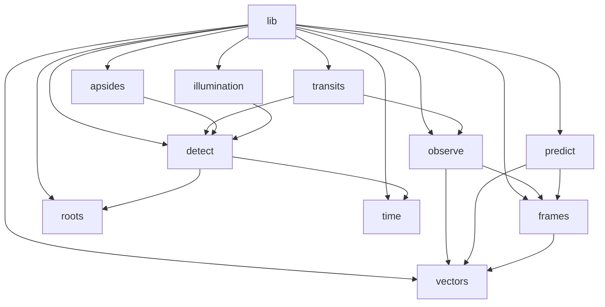
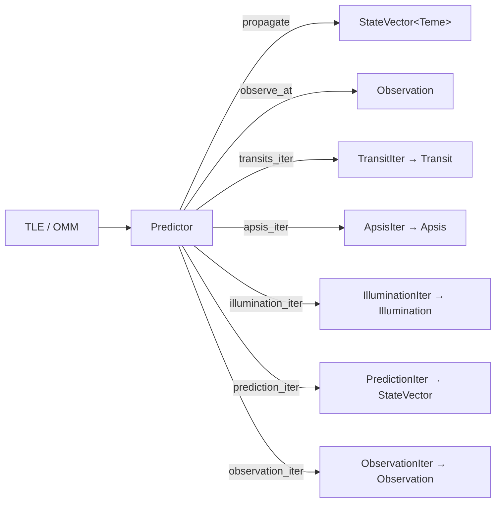

# Architecture

`sgp4-predict` wraps the [`sgp4`](https://crates.io/crates/sgp4) crate. Where `sgp4` exposes a
single propagation call, this library adds coordinate-frame conversion, ground-observer geometry,
and lazy iterators that discover transits, apsides, and illumination events over a time window.

## Module map

| Module | Responsibility |
|---|---|
| `lib.rs` | `Predictor` — the public entry point |
| `predict.rs` | SGP4 call + km→m conversion; produces `StateVector<Teme>` |
| `observe.rs` | TEME→ECEF→ENU→`Observation` pipeline |
| `detect.rs` | Generic event/window detection: `Detector`, `EventIter`, `WindowIter`, step strategies |
| `transits.rs` | `TransitIter` over `WindowIter` (event function: elevation − min_elevation) |
| `apsides.rs` | `ApsisIter` over `EventIter` (event function: radial velocity `r·v`) |
| `illumination.rs` | Cylindrical shadow model; `IlluminationIter` over `WindowIter` |
| `frames.rs` | Frame marker types `Teme`, `Ecef`, `Enu` |
| `vectors.rs` | `StateVector<F>`, `Position<F>`, `Velocity<F>`, generic over frame |
| `angle.rs` | `Degrees` / `Radians` newtypes |
| `roots.rs` | `Refinement` — bracketed hybrid root solver |
| `time.rs` | `IntervalRange` trait and `DateTimeIter` |

## Data flow

`Predictor` holds the parsed `sgp4::Elements` and exposes methods at two levels: **point queries**
(`propagate`, `observe_at`) returning a single value for an instant, and **iterators** that lazily
scan a time window and yield events or samples.

## Design notes

**Frames are checked at compile time.** `StateVector<Teme>` and `StateVector<Ecef>` are distinct
types and conversions exist only in the valid direction, so a skipped or reordered conversion is a
compile error rather than a plausible-looking wrong number. See
[coordinate-frames.md](coordinate-frames.md).

**SI units throughout.** `sgp4` returns kilometres and km/s; the `From<sgp4::Prediction>` impl in
`predict.rs` converts once, at the boundary. Nothing downstream does unit bookkeeping.

**Detection is one generic layer.** Transits, apsides, and illumination share a single skeleton —
step through time, evaluate a scalar function, watch for a sign change, refine the crossing — which
lives in `detect.rs`. The three built-in iterators are thin wrappers, and the `generics` feature
exposes the same building blocks for detecting other event kinds. See
[event-detection.md](event-detection.md).

**Events are iterators.** Detection is lazy, composes with the standard iterator adaptors, and lets
a caller looking for the next pass stop as soon as it finds one.

**Events are intervals.** `Transit` and `Illumination` implement `IntervalRange`, as does
`Range<DateTime<Utc>>`, so a discovered event can be handed straight back to `prediction_iter` or
`observation_iter` as the window to sample.
