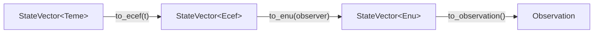

# Coordinate Frames

SGP4 returns a state vector in the **TEME** frame; a ground observer needs **ENU**. Mixing frames
produces plausible-looking but completely wrong numbers, so this library makes a wrong conversion a
compile error.

## The three frames

**TEME — True Equator, Mean Equinox.** The native output frame of SGP4. Origin at Earth's centre of
mass, X toward the mean vernal equinox, Z along Earth's rotation axis. It does not rotate with
Earth's surface — suitable for propagation, not for ground geometry.

**ECEF — Earth-Centred, Earth-Fixed.** Same origin, but X is fixed to the prime meridian, so the
frame rotates with Earth and a point on the ground has constant coordinates.

**ENU — East-North-Up.** Local to the observer: E and N tangent to the ellipsoid, U along its
normal. This is the natural basis for azimuth and elevation.

## Conversion pipeline



| Step | Method | Transform |
|---|---|---|
| TEME → ECEF | `StateVector<Teme>::to_ecef(t)` | Z-rotation by the GMST angle at `t` |
| ECEF → ENU | `StateVector<Ecef>::to_enu(observer)` | Translate to the observer, rotate to the local tangent plane |
| ENU → `Observation` | `StateVector<Enu>::to_observation()` | `atan2` for azimuth, `asin` for elevation, magnitude for range |

`Predictor::observe_at` runs the whole chain; the individual steps are public for callers who need
an intermediate frame.

## How the type safety works

`StateVector<F>` is generic over a frame marker:

```rust
pub struct StateVector<F> {
    pub position: Position<F>,
    pub velocity: Velocity<F>,
    _frame: PhantomData<F>,
}
```

`Teme`, `Ecef`, and `Enu` are empty structs used only as type parameters. `to_ecef` is implemented
only on `StateVector<Teme>` and `to_enu` only on `StateVector<Ecef>`, so the compiler rejects any
attempt to skip or reorder a conversion. `PhantomData` is zero-sized, so this costs nothing at
runtime.

## Units

Positions are in **metres**, velocities in **m/s**. `sgp4` returns kilometres; conversion happens
once in `predict.rs` before anything reaches a caller.

Observer coordinates are `Degrees`; `Observation::azimuth` and `elevation` are `Radians`. Azimuth
comes straight from `atan2`, so it spans `(-π, π]` rather than the `[0, 2π)` most tracking software
reports — call `Radians::normalized()` if you need the latter.

To supply a ground station, implement `Observer`:

- `latitude() -> Degrees` — geodetic, positive north
- `longitude() -> Degrees` — geodetic, positive east
- `altitude() -> f64` — metres above the WGS-84 ellipsoid
