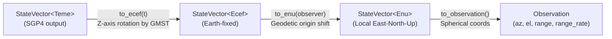

# Coordinate Frames

## Why Frames Matter

SGP4 propagation returns a satellite state vector in the **TEME** frame. Ground observers need
**ENU** (azimuth/elevation). Mixing frames silently produces plausible-looking but completely wrong
numbers — a common source of bugs in orbital mechanics software. This library makes wrong conversions
a compile error.

---

## Frame Descriptions

### TEME — True Equator Mean Equinox

The native output frame of the SGP4 propagator. The origin is Earth's centre of mass. The X-axis
points toward the mean vernal equinox, the Z-axis is aligned with Earth's rotation axis (true equator),
and the Y-axis completes the right-handed system. The frame rotates with Earth's precession but not
with Earth's surface — it is an inertial-like frame suitable for propagation, not for ground geometry.

### ECEF — Earth-Centred, Earth-Fixed

Same origin as TEME but the X-axis is fixed to the prime meridian, so the frame rotates with Earth.
A position in ECEF is constant for a fixed point on the ground. The TEME→ECEF transformation is a
rotation around the Z-axis by the **Greenwich Mean Sidereal Time (GMST)** angle at the epoch.

### ENU — East-North-Up

A local, observer-relative frame. The origin is the observer's geodetic position on Earth's surface.
Axes point:

- **E** — local East (tangent to the ellipsoid, pointing east)
- **N** — local North (tangent to the ellipsoid, pointing north)
- **U** — local Up (normal to the ellipsoid, pointing away from Earth's centre)

ENU coordinates are the natural basis for computing azimuth and elevation as seen by a ground station.

---

## Conversion Pipeline



Each step is a method on the appropriately typed `StateVector`:

| Step | Method | Transform |
|---|---|---|
| TEME → ECEF | `StateVector<Teme>::to_ecef(t)` | Z-rotation by GMST computed from `t` |
| ECEF → ENU | `StateVector<Ecef>::to_enu(observer)` | Translate to observer origin, rotate to local tangent plane |
| ENU → Observation | `StateVector<Enu>::to_observation()` | `atan2` for azimuth, `asin` for elevation, magnitude for range |

---

## Phantom Marker Pattern

`StateVector<F>` is generic over a frame marker `F`:

```rust
pub struct StateVector<F> {
    pub position: Position<F>,
    pub velocity: Velocity<F>,
    _frame: PhantomData<F>,
}
```

`Teme`, `Ecef`, and `Enu` are empty structs used only as type parameters. Because `to_ecef` is
implemented only on `StateVector<Teme>` and `to_enu` only on `StateVector<Ecef>`, the compiler
rejects any code that tries to skip or reorder conversions. There is no runtime overhead — `PhantomData`
is a zero-sized type that disappears entirely after compilation.

---

## Units

**All positions are in metres. All velocities are in m/s.**

The `sgp4` crate returns kilometres and km/s. Conversion to SI units happens immediately in
`predict.rs` inside the `From<sgp4::Prediction>` impl, before any coordinates are exposed to
callers. No unit conversion is needed anywhere else in the library or in user code.

---

## Observer Requirements

Implement the `Observer` trait on your ground-station type with three methods:

- **`latitude_deg()`**: geodetic latitude in degrees (positive north)
- **`longitude_deg()`**: geodetic longitude in degrees (positive east)
- **`altitude()`**: metres above the WGS-84 ellipsoid

The trait is intentionally degree-first since this is the commond human readable form. Radian 
conversions are handled internally by `ObserverExt`.

`Observation` provides `azimuth_deg()` and `elevation_deg()` convenience methods alongside the
radian fields (`azimuth`, `elevation`).
