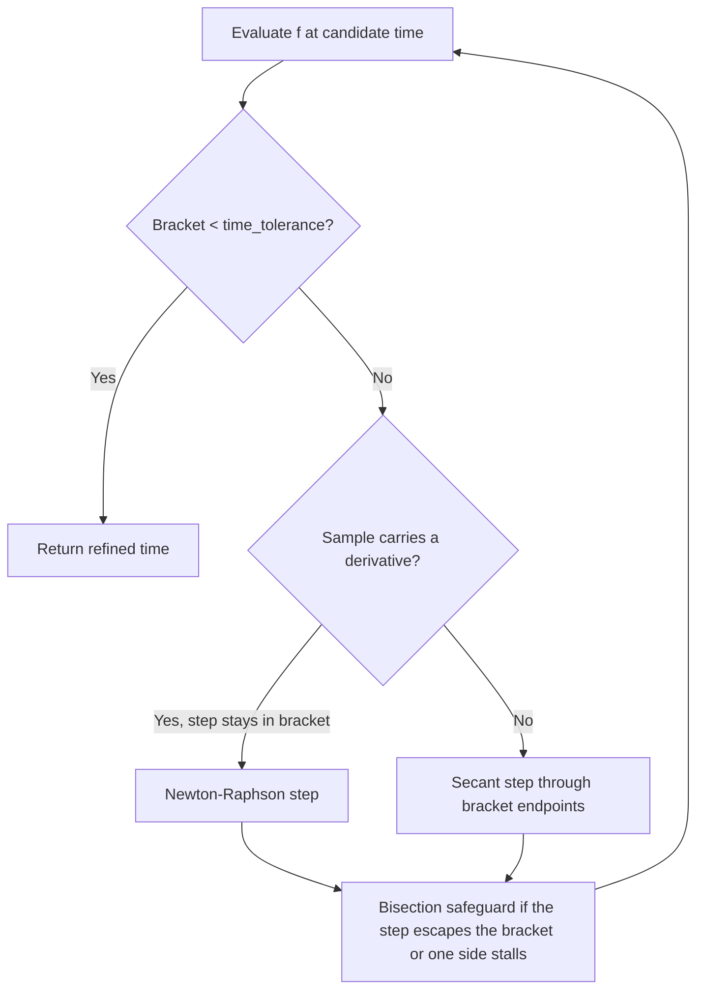
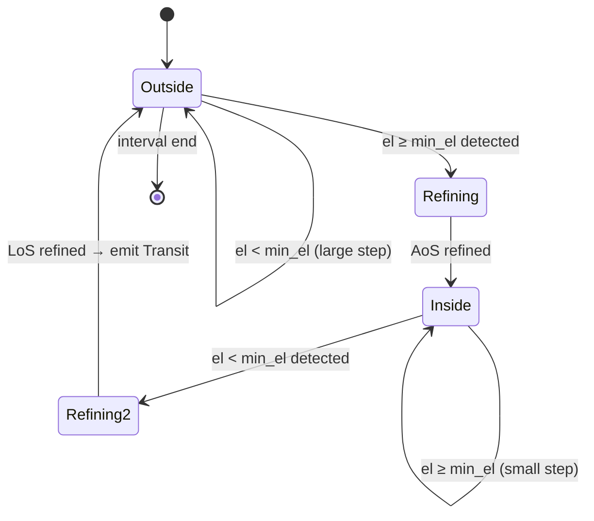

# Event Detection

Transits, apsides, and illumination windows are all found the same way: a scalar **event function**
`f(t)` is sampled across the interval by a **step strategy**, a sign change between two samples
brackets a crossing, and the crossing time is refined by a bracketed hybrid solver. `EventIter`
yields refined point crossings; `WindowIter` pairs them into intervals.

The three built-in iterators are thin wrappers over this machinery. Enabling the `generics` feature
exposes it directly, so other event kinds — ascending-node crossings via TEME `z = 0`, say — need no
bespoke iterator.

## Refining a crossing

Once a crossing is bracketed, `Refinement` solves for the zero:

The bracket never widens: every evaluation replaces the endpoint of matching sign, and bisection is
forced whenever an interpolated step leaves the bracket or the same side is updated twice running.
Convergence is therefore guaranteed regardless of the function's shape — this is the safeguarded
`rtsafe` scheme of *Numerical Recipes* §9.4, extended with a secant step for derivative-free
samples.

Convergence is measured on the bracket width in seconds (`Refinement::time_tolerance`), so timing
precision does not depend on the event function's units.

## Transits

A **transit** is a continuous interval during which the satellite's elevation exceeds
`min_elevation` — acquisition of signal (AoS) to loss of signal (LoS).

Scanning a multi-day window second by second would be wasteful, so `TransitIter` steps adaptively:
large steps (10 minutes by default) while the satellite is well below the threshold or descending
away, small steps (10 seconds) as it approaches or while it is above. The elevation function
carries its own rate of change, which both selects the step size and gives the solver a derivative
for Newton-Raphson steps — near a horizon crossing elevation is nearly linear, so a step or two
usually suffices.

Step bounds, the boundary-walk step, and the maximum transit duration are configurable via
`TransitIterOpts`.

`Predictor::max_elevation` finds the peak of a pass with the same machinery applied to a different
event function: falling zero crossings of the elevation *rate*.

## Apsides

**Apogee** and **perigee** are the maximum and minimum orbital radius. `ApsisIter` watches the sign
of the radial velocity `r·v` (position dotted with velocity) at a fixed 60-second step:

- `r·v > 0` — moving away from Earth's centre, heading for apogee
- `r·v < 0` — moving toward it, heading for perigee
- `+ → −` is an apogee, `− → +` a perigee

The derivative of `r·v` involves the jerk vector and is not cheaply available, so samples carry no
rate and the solver falls back to secant/bisection steps — which converge in a handful of iterations
on a tight bracket.

This method suits **near-circular LEO orbits** (eccentricity ≲ 0.01). On a highly elliptical orbit
the satellite moves fast enough near perigee that the 60-second default step can skip closely spaced
events; pass a smaller `step` via `ApsisIterOpts`.

## Illumination

A satellite is **sunlit** when it is outside Earth's shadow. `IlluminationIter` models the shadow as
a cylinder extending behind Earth in the anti-Sun direction and computes a scalar that is negative
in sunlight and positive in eclipse; its sign changes are refined as above (again without a
derivative). The resulting `Illumination` windows tile the interval, each tagged `Sunlit` or
`Eclipse`.

The cylindrical model ignores the **penumbra**, treating the transition as instantaneous. That is
adequate for deciding when a satellite is optically visible, but a conical shadow model would be
needed for radiometric or solar-power work.
