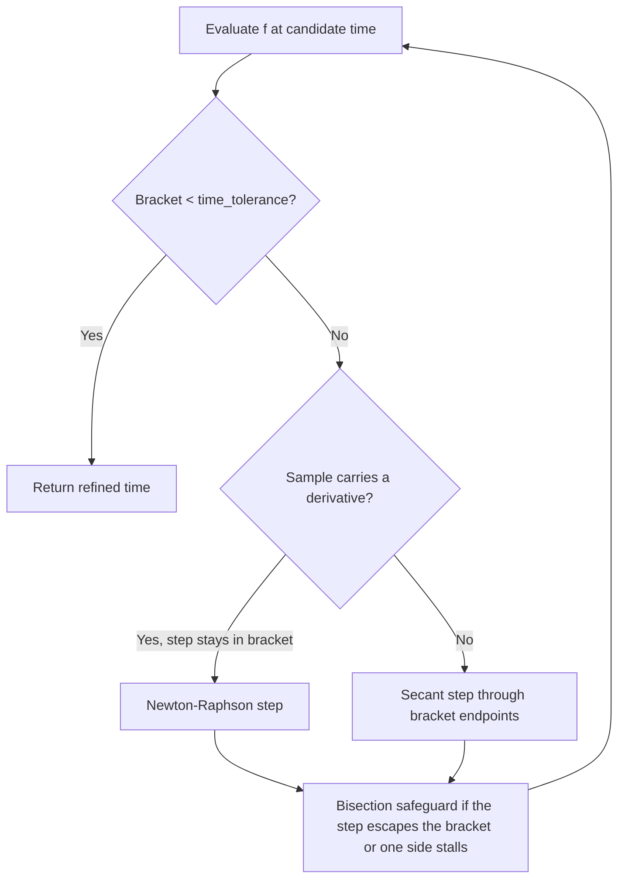
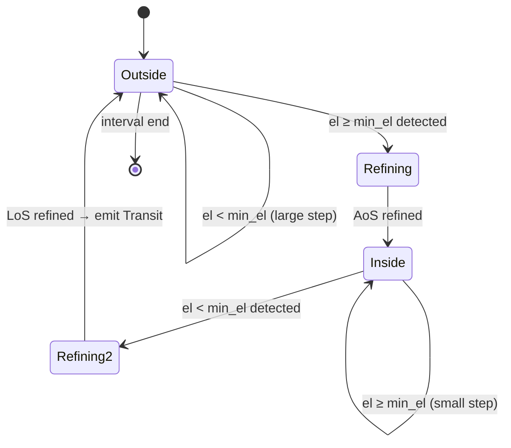
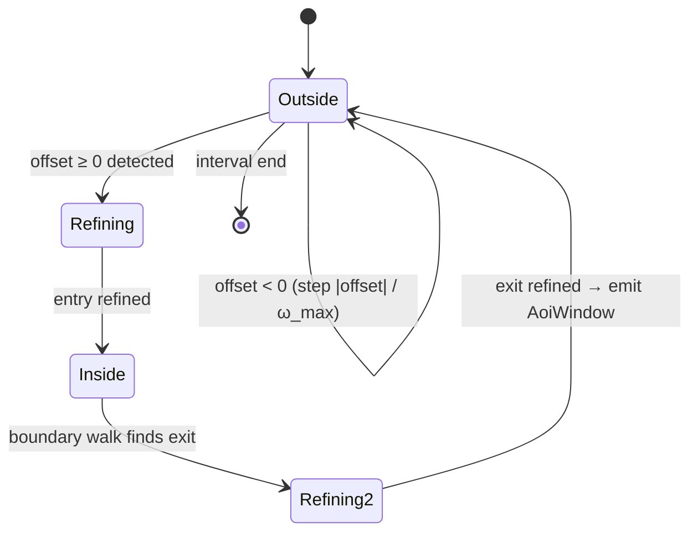

# Event Detection

Transits, apsides, and illumination windows are all found the same way: a scalar **event function**
`f(t)` is sampled across the interval by a **step strategy**, a sign change between two samples
brackets a crossing, and the crossing time is refined by a bracketed hybrid solver. `EventIter`
yields refined point crossings; `WindowIter` pairs them into intervals.

The three built-in iterators are thin wrappers over this machinery. Enabling the `generics` feature
exposes it directly, so other event kinds — ascending-node crossings via TEME `z = 0`, say — need no
bespoke iterator.

## Refining a crossing

Once a crossing is bracketed, `Refinement` solves for the zero:

The bracket never widens: every evaluation replaces the endpoint of matching sign, and bisection is
forced whenever an interpolated step leaves the bracket or the same side is updated twice running.
Convergence is therefore guaranteed regardless of the function's shape — this is the safeguarded
`rtsafe` scheme of *Numerical Recipes* §9.4, extended with a secant step for derivative-free
samples.

Convergence is measured on the bracket width in seconds (`Refinement::time_tolerance`), so timing
precision does not depend on the event function's units.

## Transits

A **transit** is a continuous interval during which the satellite's elevation exceeds
`min_elevation` — acquisition of signal (AoS) to loss of signal (LoS).

Scanning a multi-day window second by second would be wasteful, so `TransitIter` steps adaptively:
large steps (10 minutes by default) while the satellite is well below the threshold or descending
away, small steps (10 seconds) as it approaches or while it is above. The elevation function
carries its own rate of change, which both selects the step size and gives the solver a derivative
for Newton-Raphson steps — near a horizon crossing elevation is nearly linear, so a step or two
usually suffices.

Step bounds, the boundary-walk step, and the maximum transit duration are configurable via
`TransitIterOpts`.

`Predictor::max_elevation` finds the peak of a pass with the same machinery applied to a different
event function: falling zero crossings of the elevation *rate*.

## Apsides

**Apogee** and **perigee** are the maximum and minimum orbital radius. `ApsisIter` watches the sign
of the radial velocity `r·v` (position dotted with velocity) at a fixed 60-second step:

- `r·v > 0` — moving away from Earth's centre, heading for apogee
- `r·v < 0` — moving toward it, heading for perigee
- `+ → −` is an apogee, `− → +` a perigee

The derivative of `r·v` involves the jerk vector and is not cheaply available, so samples carry no
rate and the solver falls back to secant/bisection steps — which converge in a handful of iterations
on a tight bracket.

This method suits **near-circular LEO orbits** (eccentricity ≲ 0.01). On a highly elliptical orbit
the satellite moves fast enough near perigee that the 60-second default step can skip closely spaced
events; pass a smaller `step` via `ApsisIterOpts`.

## Illumination

A satellite is **sunlit** when it is outside Earth's shadow. `IlluminationIter` models the shadow as
a cylinder extending behind Earth in the anti-Sun direction and computes a scalar that is negative
in sunlight and positive in eclipse; its sign changes are refined as above (again without a
derivative). The resulting `Illumination` windows tile the interval, each tagged `Sunlit` or
`Eclipse`.

The cylindrical model ignores the **penumbra**, treating the transition as instantaneous. That is
adequate for deciding when a satellite is optically visible, but a conical shadow model would be
needed for radiometric or solar-power work.

## Areas of interest

An **area of interest** is a region on the ground; the events are the windows in which the
sub-satellite point lies inside it. `AoiIter`'s event function is the *signed angular offset* of the
ground point from the area's boundary — positive inside, negative outside, zero on the boundary.

Making that one scalar, a pure function of time, is the whole design. The obvious alternative — track
which polygon edge was crossed and keep an inside/outside flag — breaks down exactly at a vertex,
where the "is the perpendicular foot within this arc" test is identically zero for both adjoining
edges. Floating point then arbitrarily yields either no crossing or two, and a single mistake leaves
the flag inverted for the rest of the scan. With a stateless scalar there is no flag to invert.

`Polygon` computes the offset in three steps:

1. **Bounding cap.** Every vertex lies within a spherical cap of radius < 90°. A ground point outside
   that cap is outside the area, and its distance to the cap is a lower bound on its distance to the
   boundary, so the answer is returned immediately.
2. **Distance.** The minimum angular distance to any edge arc — the perpendicular foot when it falls
   within the arc, otherwise the nearer endpoint.
3. **Sign.** The winding number of the boundary about the point, from the signed angle it subtends in
   the tangent plane. `FillRule::NonZero` (the default) is inside where the winding is non-zero;
   `FillRule::EvenOdd` where it is odd. Both fall out of the same count, which is what makes
   self-intersecting rings well defined rather than merely tolerated.

Step 1 is not an optimisation. The tangent-plane angle sum measures degree on the sphere minus the
point and its antipode, so without the cap gate the *antipode* of the area also winds to ±1 and reads
as inside. This is why an area must fit within a hemisphere.

Because the offset is an angular distance and the ground point's angular speed is bounded, the
boundary cannot be reached in less than `|offset| / ω_max` seconds. `ProximityStep` steps by exactly
that, so — unlike a fixed step — the coarse scan **cannot jump over a crossing**, however narrow the
area. `ω_max` is derived in closed form from the element set (perigee angular rate, plus Earth's
rotation, plus the geodetic-latitude stretch, plus margin), so it is a true bound rather than the
largest rate some sampling happened to observe.

Two limits are worth knowing. The `min_step` floor is what keeps the scan advancing at the boundary,
and a chord traversed faster than that can still be missed — at the 1 s default, about 6.6 km of
track. Lower it for a narrower area; it is honoured down to 1 ms. And the
boundary walk uses a fixed `walk_step` rather than the adaptive one, so for a **concave** area a
notch the ground track leaves and re-enters within `walk_step` is absorbed into the surrounding
window; a convex area is unaffected. Both are configurable via `AoiIterOpts`.

`Polygon` edges are great-circle arcs in the sphere obtained by treating geodetic latitude as
spherical latitude — the S2 and BigQuery GIS convention, and *not* GeoJSON's, which RFC 7946 §3.1.1
defines as straight in longitude/latitude. Great-circle edges are what make the distance a single
`asin` and remove every antimeridian and pole special case; the cost is that they are not lines of
constant latitude: an edge between two vertices at 60°N bows poleward by about 0.02° over a 5°
longitude span and 0.09° over 10°, growing with the square of the span, so a four-vertex ring with
vertices a quarter of the globe apart reaches roughly 68°N. Since a great circle always bows toward
the nearer pole, both horizontal edges of a box shift the same way, displacing the region poleward
rather than enlarging it.

`Rectangle` is the answer for a region that genuinely is a latitude/longitude box. Its north and south
edges are parallels, whose distance is exactly the latitude difference along a meridian, and its east
and west edges are meridian arcs, whose distance is a plane `asin` as before. Containment is four
inequalities rather than a winding number, so it needs no bounding cap and has no hemisphere
restriction — a pole-to-pole wedge is fine. Two details earn their keep: a bound sitting on a pole is
not an edge (the parallel degenerates to a point interior to the box), and each meridian edge is
tested against its own half of the plane, or a point on the far side of the Earth would report itself
a few kilometres from the boundary.
