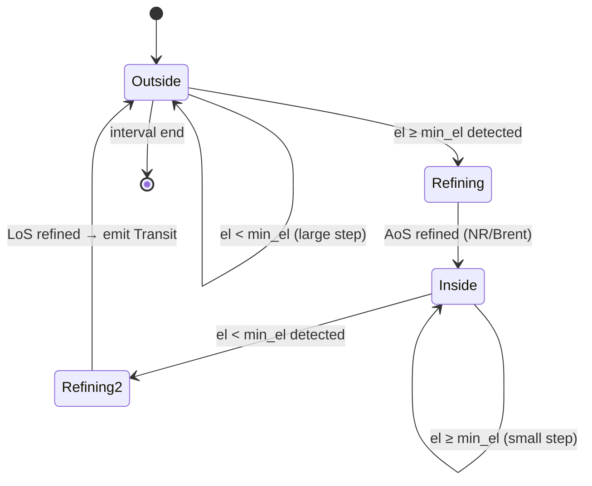
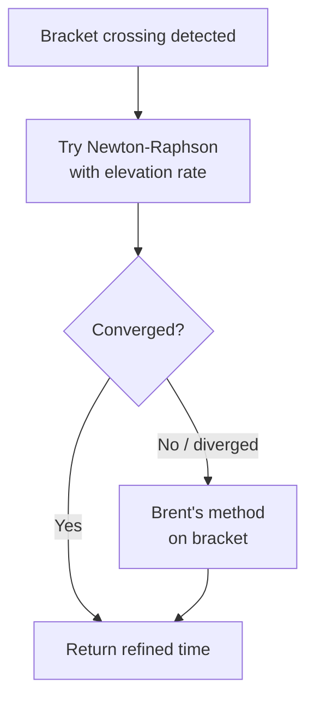

# Event Detection

## Transit Detection

A **transit** is a continuous interval during which a satellite's elevation above the observer's horizon
exceeds a configurable `min_elevation` threshold (Acquisition of Signal → Loss of Signal).

### Adaptive Stepping Strategy

`TransitIter` avoids scanning every second of a multi-day window by using two step sizes:

- **Large step** (~10 minutes): used when the satellite is well below `min_elevation` or descending away.
  Moves quickly through idle periods.
- **Small step** (~10 seconds): used when the satellite is approaching or already above `min_elevation`.
  Provides enough resolution to bracket the exact crossing precisely.

The step size is selected based on the current elevation and its rate of change, so the iterator
automatically narrows its resolution only where it matters.

### State Machine



The iterator stays in `Outside` until a step crosses the elevation threshold. It then enters a
`Refining` state to pin down the exact crossing time (AoS), switches to `Inside` to track the pass,
and refines the LoS crossing before emitting a completed `Transit` and returning to `Outside`.

### Root-Finding for AoS / LoS

Once a crossing is bracketed, the exact time is found by treating elevation as a scalar function of time
and solving for the zero:



**Newton-Raphson** uses the elevation *rate* (already computed as part of the `Observation`) as the
derivative. Near the crossing, elevation changes nearly linearly, so NR converges in one or two
iterations in the common case.

**Brent's method** is the fallback. Because the bracket is always known (the step that detected the
crossing provides both endpoints with opposite sign elevations), Brent's method is guaranteed to
converge regardless of the function's shape. It combines bisection, secant, and inverse quadratic
interpolation for efficiency.

---

## Apsis Detection

**Apogee** and **perigee** are the points of maximum and minimum orbital radius respectively.

### Radial Velocity Sign Change

`ApsisIter` monitors the **radial velocity** scalar at a fixed 60-second step:

```
r·v = position · velocity   (dot product)
```

- `r·v > 0`: satellite moving away from Earth's centre → heading toward apogee.
- `r·v < 0`: satellite moving toward Earth's centre → heading toward perigee.
- Sign change `+ → −`: apogee (`ApsisEvent::Apogee`)
- Sign change `− → +`: perigee (`ApsisEvent::Perigee`)

When a sign change is detected, the two adjacent time samples bracket the event. Brent's method
is applied to the `r·v` function on that bracket to refine the crossing time. Newton-Raphson is
not used here because the derivative of `r·v` (involving the jerk vector) is not readily available
and Brent's method converges in very few iterations on a tight bracket.

### Correctness Note

The radial-velocity sign-change method is correct and efficient for **near-circular LEO orbits**
(eccentricity ≲ 0.01). For highly elliptical orbits (HEO, Molniya), the 60-second fixed step may
skip closely-spaced events near perigee where the satellite moves very fast. If using this library
with non-LEO TLEs, consider whether apsis timing precision is critical to your use case.

---

## Illumination Detection

A satellite is **sunlit** when it is not in Earth's shadow and is therefore visible to optical
ground observers (assuming favourable geometry).

### Cylindrical Shadow Model

A simplified cylindrical shadow extends behind Earth in the anti-Sun direction. For each time step,
a **shadow scalar** is computed that is:

- **Negative** when the satellite is in sunlight.
- **Positive** when the satellite is in Earth's shadow (eclipse).

The sign change of this scalar is found using the same root-finding infrastructure as transit detection:
Newton-Raphson first, Brent's method as fallback on the bracket. `IlluminationIter` yields
`Illumination` events marking the start and end of each sunlit interval.

### Limitation

The cylindrical model ignores the **penumbra** — the partial shadow region where the satellite
receives reduced sunlight. The transition between fully sunlit and fully eclipsed is treated as
instantaneous. For most LEO scheduling applications (determining when a satellite is visible from
the ground) this approximation is adequate. For precise radiometric or solar power modelling, a
conical shadow model would be needed.
