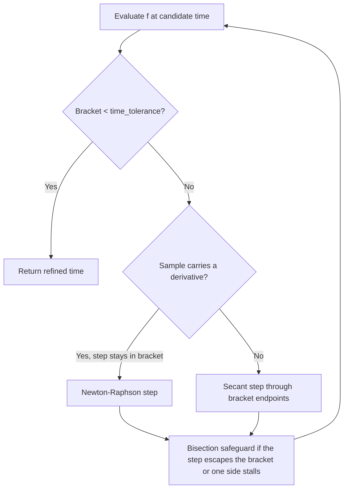

# Event Detection

Transits, apsides, illumination windows and area-of-interest overpasses are all found the same way:
a scalar **event function** `f(t)` is sampled across the interval by a **step strategy**, a sign
change between two samples brackets a crossing, and the crossing time is refined by a bracketed
hybrid solver. `EventIter` yields refined point crossings; `WindowIter` pairs them into intervals.

The built-in iterators are thin wrappers over this machinery. Enabling the `generics` feature
exposes it directly, so other event kinds — ascending-node crossings via TEME `z = 0`, say — need no
bespoke iterator.

Equator crossings, in full — the event function is a closure returning one scalar:

```rust,ignore
let crossings = EventIter::builder()
    .interval(start..end)
    .function(move |t| Ok(predictor.propagate(t)?.position.z))
    .step(FixedStep(Duration::seconds(60)))
    .build()?
    .collect::<Result<Vec<_>, _>>()?;
```

`function_with_rate` supplies a derivative for Newton-Raphson steps, `event_function` takes an
`EventFunction` impl when the sampler needs state, and `WindowIter::builder` pairs the crossings
into intervals instead. Working examples are in
[`tests/detect.rs`](../sgp4-predict/tests/detect.rs).

## Refining a crossing



The bracket never widens and bisection is forced whenever an interpolated step leaves it, so
convergence holds regardless of the function's shape. Convergence is measured on the bracket width
in seconds (`Refinement::time_tolerance`), so timing precision does not depend on the event
function's units.

## The built-in event functions

| Iterator           | Event function                                                                           | Step                                                                        |
| ------------------ | ---------------------------------------------------------------------------------------- | --------------------------------------------------------------------------- |
| `TransitIter`      | elevation − `min_elevation`, with its rate as the derivative                             | adaptive: large while below or descending, small while approaching or above |
| `ApsisIter`        | radial velocity `r·v` — `+ → −` is apogee, `− → +` perigee                               | fixed, 60 s                                                                 |
| `IlluminationIter` | cylindrical shadow scalar, negative in sunlight                                          | fixed                                                                       |
| `AoiIter`          | signed angular offset of the sub-satellite point from the area boundary, positive inside | `\|offset\| / ω_max`, which cannot reach the boundary within one step       |

Each has an `Opts` struct carrying its step bounds and caps; `Predictor::with_refinement`
configures the solver.

## Known limits

**Apsides** suit near-circular LEO orbits (eccentricity ≲ 0.01). On a highly elliptical orbit the
satellite moves fast enough near perigee that the 60-second default step can skip closely spaced
events; pass a smaller `step` via `ApsisIterOpts`.

**Illumination** ignores the penumbra, treating the transition as instantaneous. Adequate for
deciding optical visibility; radiometric or solar-power work needs a conical shadow model.

**Areas of interest** have two: the `min_step` floor bounds the shortest crossing the scan can see —
about 6.6 km of track at the 1 s default, and honoured down to 1 ms — and the boundary walk uses a
fixed `walk_step`, so a **concave** notch the ground track leaves and re-enters within that step is
absorbed into the surrounding window. Both are `AoiIterOpts` fields. `max_off_nadir` models the
field of regard as a circular cone about nadir, so an asymmetric slew limit is not represented.
