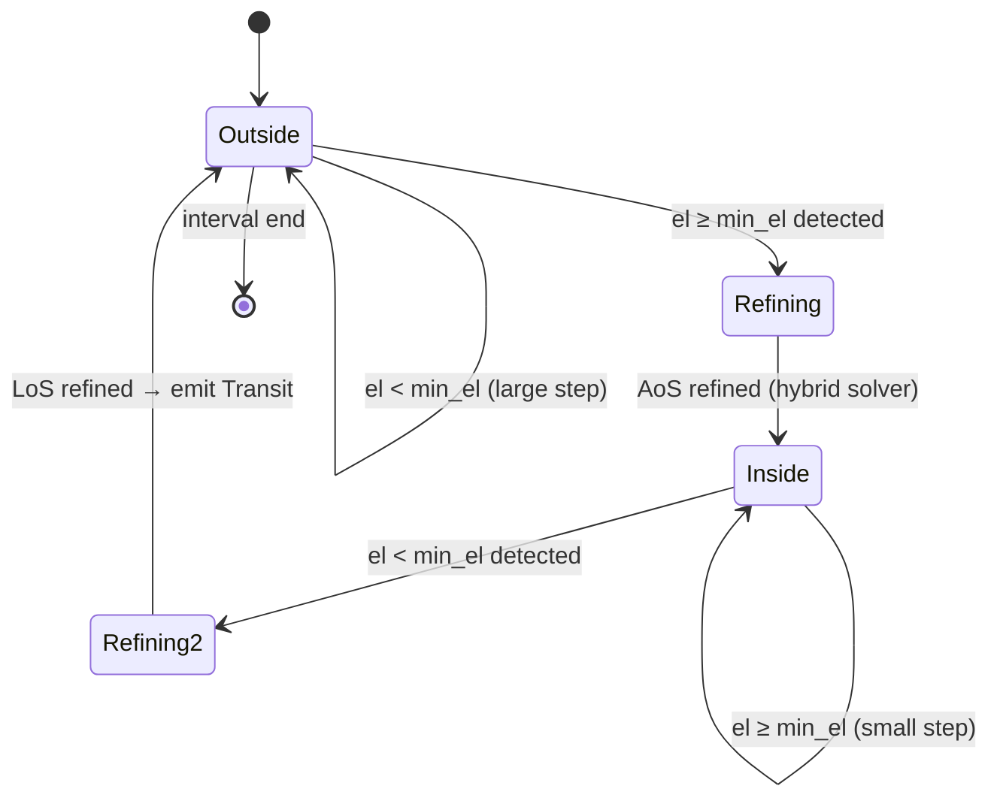
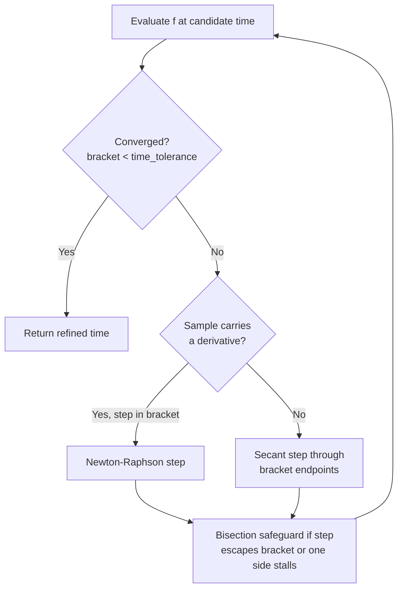

# Event Detection

All three built-in detectors (transits, apsides, illumination) are thin wrappers over the generic
`detect` module: a user-supplied scalar **event function** `f(t)` is sampled over the search interval
by a pluggable **step strategy**, sign changes between samples bracket a crossing, and the crossing is
refined by the bracketed hybrid solver (`Refinement`). `EventIter` yields refined point crossings;
`WindowIter` pairs them into windows. The same building blocks are public, so new event kinds (e.g.
ascending-node equator crossings via TEME `z = 0`) need no bespoke iterator.

## Transit Detection

A **transit** is a continuous interval during which a satellite's elevation above the observer's horizon
exceeds a configurable `min_elevation` threshold (Acquisition of Signal → Loss of Signal).

### Adaptive Stepping Strategy

`TransitIter` avoids scanning every second of a multi-day window by using two step sizes:

- **Large step** (~10 minutes): used when the satellite is well below `min_elevation` or descending away.
  Moves quickly through idle periods.
- **Small step** (~10 seconds): used when the satellite is approaching or already above `min_elevation`.
  Provides enough resolution to bracket the exact crossing precisely.

The step size is selected based on the current elevation and its rate of change, so the iterator
automatically narrows its resolution only where it matters.

### State Machine



The iterator stays in `Outside` until a step crosses the elevation threshold. It then enters a
`Refining` state to pin down the exact crossing time (AoS), switches to `Inside` to track the pass,
and refines the LoS crossing before emitting a completed `Transit` and returning to `Outside`.

### Root-Finding for AoS / LoS

Once a crossing is bracketed, the exact time is found by treating elevation as a scalar function of time
and solving for the zero with the bracketed hybrid solver. Each iteration chooses its step from the
sample it just evaluated:



**Newton-Raphson steps** use the elevation *rate* (already computed alongside the elevation) as the
derivative. Near the crossing, elevation changes nearly linearly, so a step or two usually suffices.

**The bracket never widens**: every evaluation replaces the endpoint with matching sign, and a
bisection rule (forced whenever an interpolated step leaves the bracket, or the same side has been
updated twice in a row) guarantees convergence regardless of the function's shape — the safeguarded
`rtsafe` scheme of *Numerical Recipes* §9.4, extended with a secant step for derivative-free samples.

Convergence is declared when the bracket is narrower than `Refinement::time_tolerance` (seconds), so
timing precision is independent of the event function's units.

---

## Apsis Detection

**Apogee** and **perigee** are the points of maximum and minimum orbital radius respectively.

### Radial Velocity Sign Change

`ApsisIter` monitors the **radial velocity** scalar at a fixed 60-second step:

```
r·v = position · velocity   (dot product)
```

- `r·v > 0`: satellite moving away from Earth's centre → heading toward apogee.
- `r·v < 0`: satellite moving toward Earth's centre → heading toward perigee.
- Sign change `+ → −`: apogee (`ApsisEvent::Apogee`)
- Sign change `− → +`: perigee (`ApsisEvent::Perigee`)

When a sign change is detected, the two adjacent time samples bracket the event, and the hybrid
solver refines the crossing time. The derivative of `r·v` (involving the jerk vector) is not readily
available, so samples carry no rate and the solver proceeds by secant/bisection steps — which
converge in very few iterations on a tight bracket.

### Correctness Note

The radial-velocity sign-change method is correct and efficient for **near-circular LEO orbits**
(eccentricity ≲ 0.01). For highly elliptical orbits (HEO, Molniya), the 60-second fixed step may
skip closely-spaced events near perigee where the satellite moves very fast. If using this library
with non-LEO TLEs, consider whether apsis timing precision is critical to your use case.

---

## Illumination Detection

A satellite is **sunlit** when it is not in Earth's shadow and is therefore visible to optical
ground observers (assuming favourable geometry).

### Cylindrical Shadow Model

A simplified cylindrical shadow extends behind Earth in the anti-Sun direction. For each time step,
a **shadow scalar** is computed that is:

- **Negative** when the satellite is in sunlight.
- **Positive** when the satellite is in Earth's shadow (eclipse).

The sign change of this scalar is found using the same root-finding infrastructure as transit
detection (the shadow scalar has no cheap derivative, so refinement proceeds by secant/bisection
steps). `IlluminationIter` yields `Illumination` events marking the start and end of each sunlit
interval.

### Limitation

The cylindrical model ignores the **penumbra** — the partial shadow region where the satellite
receives reduced sunlight. The transition between fully sunlit and fully eclipsed is treated as
instantaneous. For most LEO scheduling applications (determining when a satellite is visible from
the ground) this approximation is adequate. For precise radiometric or solar power modelling, a
conical shadow model would be needed.
